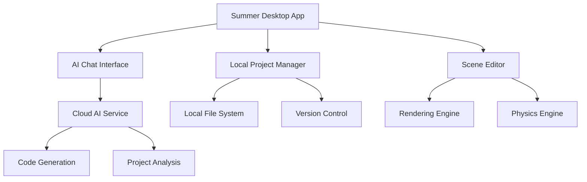

## System Overview

Summer is built as a hybrid desktop application with cloud-enhanced AI capabilities.



## Core Components

### Desktop Application
- **Framework**: Professional game engine stack for native performance
- **UI**: Custom editor interface with dockable panels
- **Platform**: Cross-platform (Windows, macOS, Linux)

### AI Integration
- **Local Analysis**: Project indexing happens on your machine
- **Cloud Processing**: Complex AI operations use cloud GPUs
- **Hybrid Approach**: Sensitive code never leaves your computer

### Project Management
- **File Watching**: Real-time monitoring of project changes
- **Version Control**: Git integration with automatic commits
- **Backup System**: Automatic project backups before AI changes

## AI Pipeline

<Steps>
  <Step title="Input Processing">
    User message is parsed and analyzed for intent
  </Step>
  <Step title="Context Gathering">
    Relevant project files and structure are identified
  </Step>
  <Step title="Plan Generation">
    AI creates a step-by-step plan for the requested changes
  </Step>
  <Step title="Code Generation">
    Specific code and scene modifications are generated
  </Step>
  <Step title="Validation">
    Changes are validated against project constraints
  </Step>
  <Step title="Application">
    Changes are applied through the editor's APIs
  </Step>
</Steps>

## Security Model

### Data Privacy
- **Local First**: All project analysis happens locally
- **Encrypted Transit**: API calls use TLS 1.3
- **No Code Storage**: Your code is never stored on our servers
- **Anonymized Telemetry**: Only usage patterns, never code content

### Safe Operations
- **Undo System**: All changes integrate with editor undo
- **Validation**: AI changes are validated before application
- **Sandboxing**: AI operations run in isolated contexts
- **User Approval**: Complex changes require explicit confirmation

## Performance Optimizations

### Local Processing
```
Project Indexing (Local)
├── AST Parsing → Symbol Tables
├── Dependency Analysis → Call Graphs  
├── Pattern Recognition → Style Guides
└── Caching → Fast Retrieval
```

### Cloud Efficiency
- **Request Batching**: Multiple operations combined
- **Smart Caching**: Frequently used patterns cached
- **Edge Computing**: Servers close to users
- **Load Balancing**: Automatic scaling

## Plugin Architecture

Summer supports extensions through a plugin system:

```gdscript
# Example plugin structure
extends SummerPlugin

func _ready():
    register_command("my_command", handle_command)
    add_menu_item("Tools/My Plugin", show_dialog)

func handle_command(args: Dictionary):
    # Custom AI command logic
    pass
```

### Plugin Capabilities
- **Custom AI Commands**: Add domain-specific operations
- **UI Extensions**: New panels and dialogs
- **File Handlers**: Support for additional file types
- **Integration Hooks**: Connect to external tools

## Development

Summer is built with a modular architecture designed for performance and maintainability.

### Development Setup

<CodeGroup>

```bash Clone & Build
# Clone the repository
git clone https://github.com/SummerEngine/Summer.git
cd Summer

# Install dependencies
./scripts/setup.sh

# Build debug version
scons platform=linux target=editor dev=yes

# Run Summer
./bin/summer.linux.editor.dev.x86_64
```

```bash Plugin Development
# Create new plugin
./scripts/create_plugin.sh my_plugin

# Install for development
ln -s $(pwd)/plugins/my_plugin ~/.summer/plugins/

# Hot reload during development
./bin/summer --dev-plugins
```

</CodeGroup>

## Technical Specifications

### System Requirements
- **Minimum RAM**: 4GB (8GB recommended)
- **Graphics**: OpenGL 3.3+ or Vulkan 1.0+
- **Storage**: 2GB available space
- **Network**: Required for AI features

### Performance Targets
- **Startup Time**: < 3 seconds
- **Project Load**: < 5 seconds for typical projects
- **AI Response**: < 10 seconds for simple operations
- **Memory Usage**: < 1GB for editor + small project

### API Limits
- **Free Tier**: 100 AI operations/month
- **Pro Tier**: Unlimited operations
- **Rate Limits**: 60 requests/minute
- **File Size**: 100MB max per project upload

