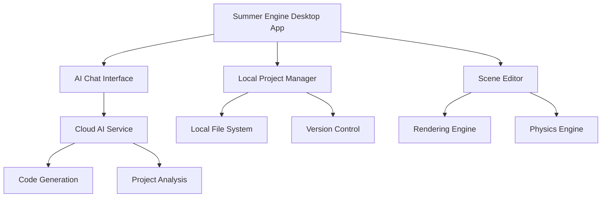

## System Overview

Summer Engine is built as a hybrid desktop application with cloud-enhanced AI capabilities.


```mermaid
graph TB
    A[Summer Engine Desktop App] --> B[Local Project Manager]
    A --> C[AI Chat Interface]
    A --> D[Scene Editor]
    
    C --> E[Cloud AI Service]
    E --> F[Code Generation]
    E --> G[Project Analysis]
    
    B --> H[Local File System]
    B --> I[Version Control]
    
    D --> J[Rendering Engine]
    D --> K[Physics Engine]
```

## Core Components

### Desktop Application
- **Framework**: Professional game engine stack for native performance
- **UI**: Custom editor interface with dockable panels
- **Platform**: Cross-platform (Windows, macOS, Linux)

### AI Integration
- **Local Analysis**: Project indexing happens on your machine
- **Cloud Processing**: Complex AI operations use cloud GPUs
- **Hybrid Approach**: Sensitive code never leaves your computer

### Project Management
- **File Watching**: Real-time monitoring of project changes
- **Version Control**: Git integration with automatic commits
- **Backup System**: Automatic project backups before AI changes

## AI Pipeline

<Steps>
  <Step title="Input Processing">
    User message is parsed and analyzed for intent
  </Step>
  <Step title="Context Gathering">
    Relevant project files and structure are identified
  </Step>
  <Step title="Plan Generation">
    AI creates a step-by-step plan for the requested changes
  </Step>
  <Step title="Code Generation">
    Specific code and scene modifications are generated
  </Step>
  <Step title="Validation">
    Changes are validated against project constraints
  </Step>
  <Step title="Application">
    Changes are applied through the editor's APIs
  </Step>
</Steps>

## Security Model

### Data Privacy
- **Local First**: All project analysis happens locally
- **Encrypted Transit**: API calls use TLS 1.3
- **No Code Storage**: Your code is never stored on our servers
- **Anonymized Telemetry**: Only usage patterns, never code content

### Safe Operations
- **Undo System**: All changes integrate with editor undo
- **Validation**: AI changes are validated before application
- **Sandboxing**: AI operations run in isolated contexts
- **User Approval**: Complex changes require explicit confirmation

## Performance Optimizations

### Local Processing
```
Project Indexing (Local)
├── AST Parsing → Symbol Tables
├── Dependency Analysis → Call Graphs  
├── Pattern Recognition → Style Guides
└── Caching → Fast Retrieval
```

### Cloud Efficiency
- **Request Batching**: Multiple operations combined
- **Smart Caching**: Frequently used patterns cached
- **Edge Computing**: Servers close to users
- **Load Balancing**: Automatic scaling

## Extensibility

Summer Engine supports the standard plugin system from its underlying engine:

- **Editor plugins**: Custom panels, inspectors, and tools
- **GDScript addons**: Third-party libraries and tools
- **MCP integration**: Connect external AI tools via the Model Context Protocol

Most Godot plugins work in Summer Engine without changes. See [Godot Compatibility](/knowledge-base/godot-compatibility) for details.

## Development

Summer Engine is built with a modular architecture designed for performance and maintainability.

### Getting Started

Download Summer Engine from [summerengine.com/download](https://summerengine.com/download) or install via CLI:

```bash
npx summer-engine install
```

See the [CLI Reference](/mcp/cli-reference) for all commands.

## Technical Specifications

### System Requirements
- **Minimum RAM**: 4GB (8GB recommended)
- **Graphics**: OpenGL 3.3+ or Vulkan 1.0+
- **Storage**: 2GB available space
- **Network**: Required for AI features

### Performance Targets
- **Startup Time**: < 3 seconds
- **Project Load**: < 5 seconds for typical projects
- **AI Response**: < 10 seconds for simple operations
- **Memory Usage**: < 1GB for editor + small project

### Usage Limits
- **Hobby (Free)**: Limited agent use, 100 MCP calls/week
- **Pro**: Extended usage, 1M MCP calls/week
- See [Pricing](/essentials/pricing) for full details

